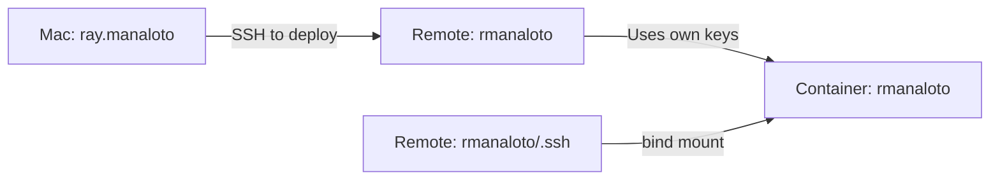

# SSH Key and User Audit Report

**Date:** 2025-01-23
**Issue:** Confusion between Mac user and remote user SSH keys
**Status:** 🔴 Critical - Security and workflow confusion

---

## Executive Summary

There is significant confusion in the codebase about SSH key usage and user identities:
- **Mac user:** ray.manaloto@tastytrade.com (runs deployment script)
- **Remote user:** rmanaloto (owns devcontainer on c0802s4.ny5)
- **Current behavior:** Syncing Mac user's SSH keys to remote host (unnecessary and potentially insecure)

---

## Current Problematic Flow

### What's Happening Now


1. **Mac user** (ray.manaloto@tastytrade.com) runs deployment script
2. Script **syncs Mac SSH keys** to remote at `~/devcontainers/ssh_keys/`
3. These keys are **bind-mounted** into container
4. Mac user SSHs to container using **their own key**

### Why This Is Wrong

1. **Unnecessary:** Remote user (rmanaloto) should have their own SSH keys
2. **Security Risk:** Even though we filter private keys now, we're still copying unnecessary data
3. **Confusing:** Mixing identities between Mac user and remote user
4. **Inefficient:** Copying keys that may not be needed

---

## SSH Key Usage Analysis

### Current Script Behavior

**File:** `scripts/deploy_remote_devcontainer.sh`

#### Line 41: SSH Sync Source
```bash
SSH_SYNC_SOURCE="${SSH_SYNC_SOURCE:-"$HOME/.ssh/"}"  # Mac user's .ssh directory
```
**Problem:** Defaults to syncing Mac user's entire .ssh directory

#### Line 42: Sync Flag
```bash
SYNC_MAC_SSH="${SYNC_MAC_SSH:-1}"  # Enabled by default
```
**Problem:** Syncing is on by default when it may not be needed

#### Lines 119-125: The Sync Operation
```bash
if [[ "${SYNC_MAC_SSH}" == "1" ]]; then
  echo "Syncing SSH public keys and config to remote..."
  rsync ... "${SSH_SYNC_SOURCE}" "${REMOTE_USER}@${REMOTE_HOST}:${REMOTE_SSH_SYNC_DIR}/"
```
**Current Behavior:**
- Syncs Mac user's SSH directory to `~/devcontainers/ssh_keys/` on remote
- Now filters to only .pub files, config, known_hosts (good)
- But still unnecessary if remote user has their own keys

#### Lines 167-170: Additional Key Copy
```bash
echo "Copying key to remote cache..."
scp "$SSH_KEY_PATH" "${REMOTE_USER}@${REMOTE_HOST}:${REMOTE_KEY_PATH}"
```
**Problem:** Duplicates key copying - already done via rsync

---

## Proposed Solution

### Option 1: Use Remote User's Keys (RECOMMENDED)

**Principle:** The remote user (rmanaloto) should manage their own SSH keys



**Changes Required:**
1. **Disable Mac SSH sync by default:**
   ```bash
   SYNC_MAC_SSH="${SYNC_MAC_SSH:-0}"  # Default OFF
   ```

2. **Use remote user's keys for container:**
   - Remote user generates their own SSH keypair: `ssh-keygen -t ed25519`
   - Add their public key to container's authorized_keys
   - Bind mount remote user's .ssh directory (not Mac user's)

3. **Documentation updates:**
   - Clear separation of Mac user vs remote user
   - Setup instructions for remote user's SSH keys

### Option 2: SSH Agent Forwarding Only (CLEANER)

**Principle:** Use SSH agent forwarding, no key syncing at all


**Benefits:**
- No keys copied anywhere
- Most secure (keys never leave Mac)
- Already implemented in scripts

**Changes Required:**
1. Remove SYNC_MAC_SSH entirely
2. Update docs to use SSH agent forwarding
3. Remove bind mount of SSH keys

---

## Files Requiring Updates

### Scripts to Update

1. **scripts/deploy_remote_devcontainer.sh**
   - Line 42: Change `SYNC_MAC_SSH="${SYNC_MAC_SSH:-1}"` to `:-0`
   - Lines 119-128: Make SSH sync optional with clear documentation
   - Lines 167-170: Review if key copying is needed

2. **scripts/test_devcontainer_ssh.sh**
   - Already supports agent forwarding ✅
   - May need to update default key paths

### Documentation to Update

1. **All deployment docs** - Clarify Mac user vs remote user
2. **TEST_BRANCH_README.md** - Update test procedures
3. **REFACTORING_ROADMAP.md** - Add user separation as task
4. **AI_AGENT_CONTEXT.md** - Update validation commands

---

## Security Implications

### Current Issues

1. **Identity Confusion:** Unclear who owns which keys
2. **Unnecessary Sync:** Copying keys that aren't needed
3. **Bind Mount Risk:** SSH keys exposed in container (even if read-only)

### After Fix

1. **Clear Separation:** Mac user and remote user are distinct
2. **No Unnecessary Sync:** Each user manages their own keys
3. **Agent Forwarding:** Most secure option, keys never copied

---

## Recommended Action Plan

### Phase 1: Immediate Clarification (TODAY)
1. Document current behavior clearly
2. Add warnings about Mac SSH sync
3. Test with `SYNC_MAC_SSH=0` to verify it's not needed

### Phase 2: Implement Clean Separation (THIS WEEK)
1. Update scripts to default `SYNC_MAC_SSH=0`
2. Document remote user SSH key setup
3. Test both workflows (remote keys and agent forwarding)

### Phase 3: Remove Legacy Behavior (NEXT WEEK)
1. Remove SSH key syncing code entirely
2. Use only agent forwarding or remote user's keys
3. Update all documentation

---

## Testing Commands

### Test 1: Verify Remote User Has SSH Keys
```bash
ssh rmanaloto@c0802s4.ny5 'ls -la ~/.ssh/'
# Should see rmanaloto's own keys
```

### Test 2: Test Without Mac SSH Sync
```bash
SYNC_MAC_SSH=0 ./scripts/deploy_remote_devcontainer.sh
# Should work if remote user has proper keys
```

### Test 3: Test Agent Forwarding
```bash
eval "$(ssh-agent -s)"
ssh-add ~/.ssh/id_ed25519
ssh -A rmanaloto@c0802s4.ny5
# Inside remote: ssh-add -l  # Should see your key
```

---

## Conclusion

The current implementation unnecessarily syncs Mac user's SSH keys to the remote host. This creates confusion about user identity and is a potential security risk. The recommended solution is to:

1. **Immediately:** Disable Mac SSH sync by default
2. **Short term:** Have remote user manage their own keys
3. **Long term:** Use SSH agent forwarding exclusively

This will create a cleaner, more secure, and less confusing workflow.